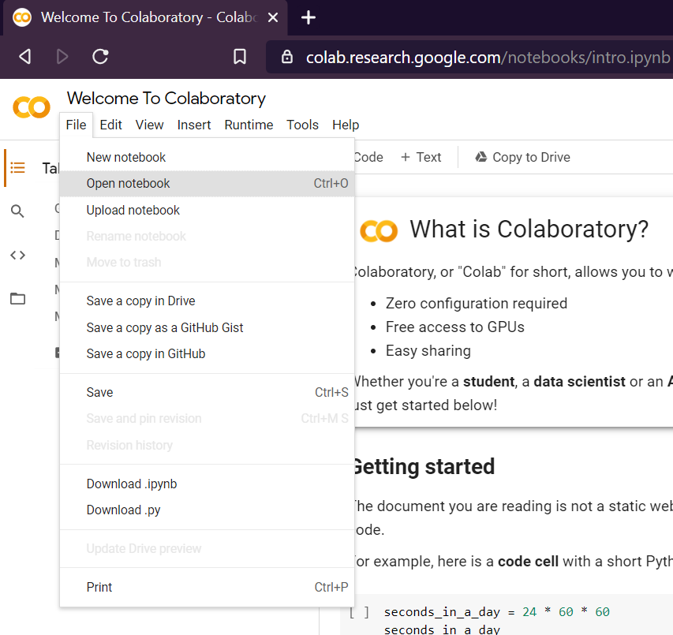
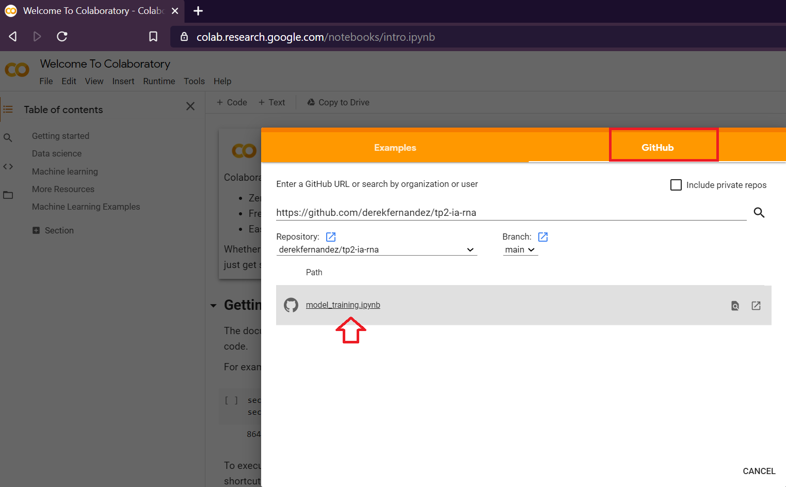
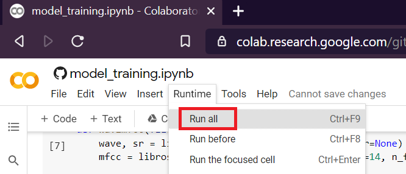

# Inteligencia Artificial - TP2: Sistemas Inteligentes

El trabajo practica fue desarrollado para ser ejecutado en Google Colab. 

A continuacion, detallos los pasos a seguir para entrenar y correr predicciones con el modelo:

## Instrucciones de uso

Dirigirse a [Google Colab](https://colab.research.google.com/) e iniciar sesión.

Una vez allí, seleccionar la opción `Open notebook`, bajo el menú `File`.

Seleccionar `Github` como origen, ingresar la URL de este repositorio (https://github.com/derekfernandez/tp2-ia-rna) y abrir `model_training.ipynb`

Finalmente, una vez cargado el desarrollo del modelo en la suite de Google Colab, del menú `Runtime` seleccionar la opción `Run all`, que ejecutara todas las celdas en orden secuencial

> Nota: La primera vez que se ejecute el modelo, será necesario autorizar acceso a Drive, ya que allí se almacenara temporalmente el dataset usado para entrenar y validar el modelo generado
